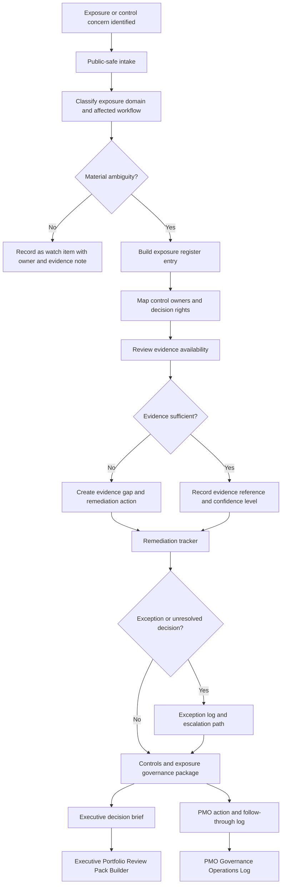

# Controls Exposure Governance Toolkit

A public-safe, AI-assisted operating toolkit for making exposure, controls, ownership, remediation, evidence, exceptions, and escalation paths visible before risk becomes an unmanaged executive problem.

## Operating problem

Risk, financial exposure, compliance obligations, supplier remediation, reimbursement controls, and audit evidence often sit outside normal project governance until a problem escalates. Leaders need a lightweight way to see what is exposed, who owns the controls, what evidence exists, what remediation is underway, which exceptions remain open, and which decisions require human authority.

## Who it is for

This repository is for PMO, portfolio, program, finance operations, supplier governance, compliance operations, audit readiness, revenue operations, and executive operations leaders who need a structured view of exposure without turning the work into legal, audit, or accounting theater.

## What it does

- Captures exposure and control ambiguity in a structured intake record.
- Classifies exposure by domain, owner, workflow, evidence state, remediation path, and decision need.
- Produces an exposure register, control owner map, remediation tracker, exception log, evidence register, and escalation path.
- Separates operating facts from determinations reserved for legal, compliance, security, privacy, audit, finance, accounting, or executive authorities.
- Hands decisions and actions into adjacent portfolio governance modules.

## What it does not do

This toolkit does not provide legal, compliance, privacy, security, audit, finance, or accounting determinations. It does not certify controls, approve remediation closure, accept residual risk, commit funds, notify stakeholders, change supplier terms, alter access, shut down tools, or replace accountable control owners.

## Architecture decision

| Area | Decision |
|---|---|
| Operating problem | Exposure and control ambiguity need to be visible before they become unmanaged executive escalations. |
| Existing adjacent modules | Business Case System, Project Charter Initiation Agent, AI Artifact Lifecycle Governance System, Release Readiness and UAT Governance Pack, Partner Ecosystem Governance Pack, Executive Portfolio Review Pack Builder, and PMO Governance Operations Log. |
| What's missing | A cross-cutting governance aid for exposure, controls, ownership, remediation, evidence, exceptions, and escalation logic. |
| Lifecycle position | After a risk/control concern is identified; before executive decision packaging and action follow-through. |
| This module owns | Exposure intake, control-owner mapping, evidence/gap visibility, remediation tracking, exception routing, and escalation framing. |
| Adjacent modules own | Investment case, chartering, artifact lifecycle disposition, release readiness, partner governance, executive review, and operational follow-through. |
| Accepted inputs | Concern notes, supplier issues, billing/reimbursement anomalies, inherited platform notes, audit findings, control gaps, unresolved exceptions, remediation updates, and decision requests. |
| Produced outputs | Controls and exposure governance package, decision brief, escalation path, and follow-through handoff. |
| Downstream handoffs | Executive decisions to Executive Portfolio Review Pack Builder; actions, blockers, and due dates to PMO Governance Operations Log. |
| Human-owned decisions | Risk acceptance, control sufficiency, legal/compliance interpretation, audit response, accounting treatment, funding, stakeholder notification, and closure. |
| Non-overlap boundary | It makes control exposure governable; it does not score portfolio priority, approve business cases, write charters, execute UAT, or run PMO meetings. |

## Boundary

This module starts when a project, portfolio, vendor program, financial workflow, compliance issue, or operational process has material exposure or control ambiguity.

It ends with a controls and exposure governance package: exposure register, control owner map, remediation tracker, exception log, evidence register, and escalation path.

It produces governance artifacts for human review.

It hands executive decisions to Executive Portfolio Review Pack Builder and follow-through items to PMO Governance Operations Log.

It does not make legal, compliance, privacy, security, audit, finance, accounting, or executive determinations.

## Installation and usage

### ChatGPT Project runtime

Create a new ChatGPT Project and upload only the files inside `chatgpt-project/`.

Do not upload the full repository into ChatGPT. The repository root is for GitHub discovery, examples, workflow source, and quality review. The runtime product is the flat `chatgpt-project/` folder.

Suggested first prompt:

```text
Use the Controls Exposure Governance Toolkit. Start with intake. I have a control or exposure concern involving [brief description]. Ask only for the minimum information needed to build a first-pass governance package.
```

### Full repository use for Codex or local work

Use the full repository when you want to inspect the package, publish it to GitHub, review the examples, modify the runtime files, or run local packaging checks. No application server, package manager, or configuration file is required.

```text
controls-exposure-governance-toolkit/
  README.md
  AGENTS.md
  LICENSE.md
  .gitignore
  chatgpt-project/
  examples/
  workflow/
  quality-review/
```

## Adjacent module fit

| Flow | Module | Relationship |
|---|---|---|
| Upstream | Business Case System | Receives unresolved risk/control concerns from business case review. |
| Upstream | Project Charter Initiation Agent | Receives control ambiguity found during chartering or planning handoff. |
| Upstream | Partner Ecosystem Governance Pack | Receives supplier, partner, reimbursement, channel, or obligation concerns. |
| Upstream | Release Readiness and UAT Governance Pack | Receives launch blockers, control gaps, evidence gaps, or signoff ambiguity. |
| Upstream | AI Artifact Lifecycle Governance System | Receives artifact reliance, access, evidence, and control concerns. |
| Downstream | Executive Portfolio Review Pack Builder | Sends decisions that require executive tradeoff, funding, exception, or risk review. |
| Downstream | PMO Governance Operations Log | Sends actions, owners, blockers, due dates, escalations, and follow-up items. |

## Workflow



The Mermaid source is available in `workflow/workflow.mmd`.

## Folder structure

```text
controls-exposure-governance-toolkit/
  README.md
  AGENTS.md
  LICENSE.md
  .gitignore
  chatgpt-project/
    start-here.md
    operating-model.md
    trigger-map.md
    exposure-intake-record.md
    control-owner-map.md
    remediation-tracker-template.md
    exception-log-rules.md
    evidence-register-rules.md
    escalation-path-rules.md
    output-templates.md
    handoff-rules.md
    working-session-prompts.md
    quality-review-rubric.md
    privacy-human-control.md
    glossary.md
  examples/
    sample-data.html
    sample-prompts.html
    sample-output.html
  workflow/
    workflow.mmd
  quality-review/
    package-test-results.html
```

## Runtime file count and constraints

The ChatGPT runtime is a flat folder with 15 Markdown files. There are no nested runtime folders. The files are concise, self-contained, non-duplicative, and designed to be uploaded together into a ChatGPT Project.

## Primary outputs

- Exposure register
- Control owner map
- Remediation tracker
- Exception log
- Evidence register
- Escalation path
- Executive decision brief
- PMO action handoff

## Example locations

- `examples/sample-data.html` contains the fictional inherited supplier, billing, and partner-reimbursement exposure scenario.
- `examples/sample-prompts.html` contains prompts for running the toolkit in ChatGPT.
- `examples/sample-output.html` shows a sample controls and exposure governance package using dummy data only.

## Human-control statement

This toolkit supports intake, classification, synthesis, evidence review, routing, drafting, and quality review. Humans remain accountable for legal, compliance, security, privacy, audit, finance, accounting, risk acceptance, funding, supplier, stakeholder, and executive decisions.

## License

Source code and scripts are licensed under MIT. Documentation, prompts, templates, examples, and other non-code materials are licensed under CC BY 4.0 with attribution to Marco Policani. See `LICENSE.md`.

## Search keywords

PMO governance, portfolio governance, controls exposure, risk register, exposure register, control owner map, remediation tracker, exception log, evidence register, audit readiness, supplier remediation, reimbursement controls, financial exposure, compliance operations, executive escalation, ChatGPT Project, AI-assisted governance, human-governed AI.
